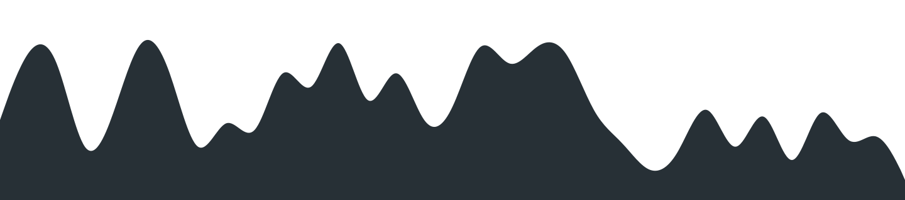

### Hi there 👋

I'm a full stack developer.

I'm currently learning more about CyberSecurity by studing towards a Diploma.
I have achieved my Sec+ Certification from CompTIA (Security+) and am currently working on getting my CySA+ (CyberSecurity Analyst+).

You can also find my blog posts and other portfolio work at my website [Oxynerd.com](https://oxynerd.com)

</img>
<!--
**devon-the-developer/devon-the-developer** is a ✨ _special_ ✨ repository because its `README.md` (this file) appears on your GitHub profile.

Here are some ideas to get you started:

- 🔭 I’m currently working on ...
- 🌱 I’m currently learning ...
- 👯 I’m looking to collaborate on ...
- 🤔 I’m looking for help with ...
- 💬 Ask me about ...
- 📫 How to reach me: ...
- 😄 Pronouns: ...
- ⚡ Fun fact: ...
-->
